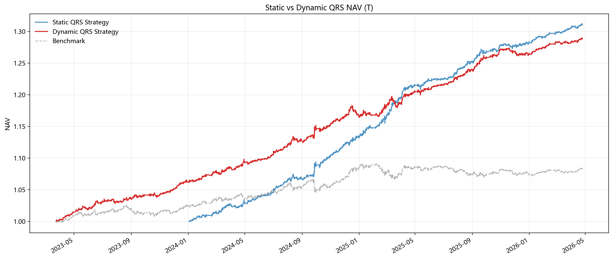
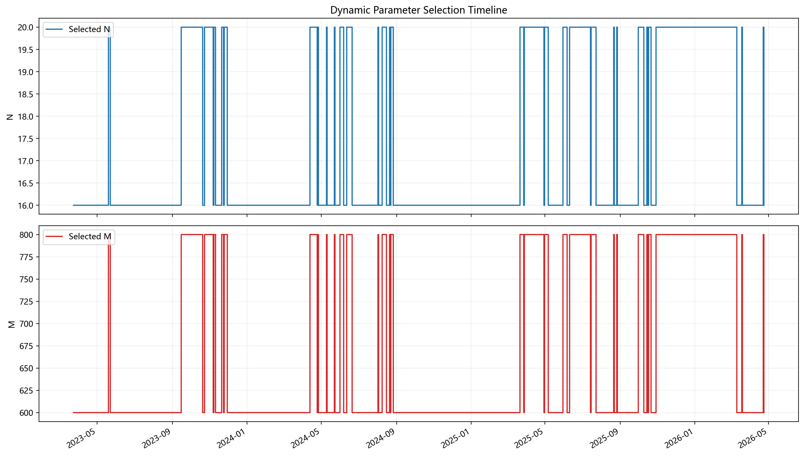
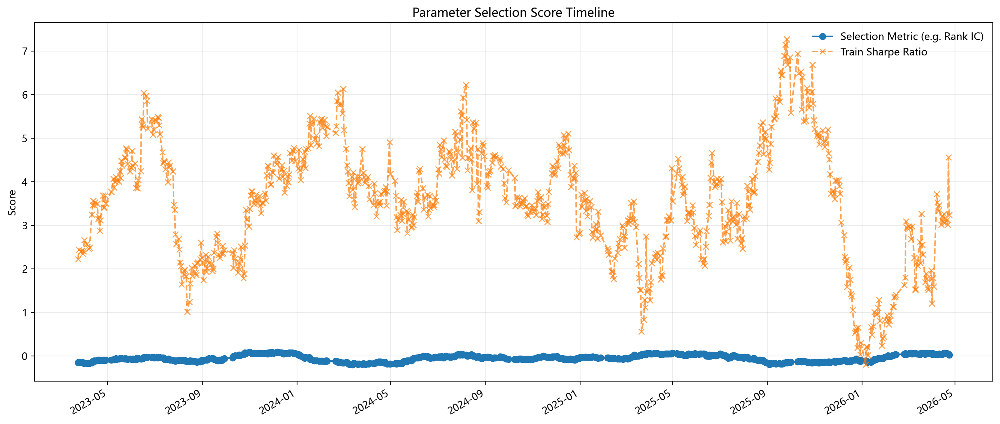

# 基于 QRS 的中国国债期货择时框架 | QRS-Based Timing Strategy for Chinese Government Bond Futures

<p align="center">
  <a href="#zh"></a>
  <a href="#en"></a>
</p>

<p align="center">
  
  
  
</p>

<a id="zh"></a>

## 简体中文

当前语言：中文 | [Switch to English](#en)

---

## 1. 项目简介

本项目是基于 **QRS（Quantified Resistance/Support）** 指标的中国国债期货择时研究框架。

- **核心策略**：动态参数选择与样本外 Walk-Forward 回测。
- **理论来源**：本项目核心思路参考自中金公司（CICC）量化研究报告 **《金融工程视角下的技术择时艺术》** 以及浙商证券的相关研究。
- **数据基础**：使用 5 分钟级别的高频 OHLC 数据计算 QRS 因子。
- **技术栈**：因子预测能力评价 (IC/Rank IC)、滚动窗口参数优化、动态趋势过滤、状态机仓位管理。
- **研究对象**：重点针对国债期货 T（10年期）、TL（30年期）等活跃合约。
- **免责声明**：本项目仅作为量化研究框架展示，不构成任何投资建议。

## 2. 核心模型逻辑

### 2.1 QRS 因子构建

QRS 类指标源自对 RSRS 指标的改进，核心思想是通过价格区间中的支撑与阻力关系来刻画趋势的“纯度”和“质量”。在滚动窗口 $N$ 内，对 5 分钟 Bar 的最高价和最低价进行局部线性回归：

$$
high_t = \alpha + \beta \cdot low_t + \varepsilon_t
$$

- **$\beta$ (斜率)**：反映了支撑与阻力关系的动态变化。
- **拟合优度 $R^2$**：用于衡量趋势拟合的可靠性。

### 2.2 动态参数优化框架

传统静态 Grid Search 容易陷入过拟合。本项目升级为动态参数选择框架：

1. **因子预测能力评价 (Predictive Power)**：使用 IC、Rank IC 和未来收益分位差 (Future Return Spread) 评价 QRS 因子对未来 $h$ 个 Bar 收益的解释力。
2. **滚动训练窗口 (Rolling Train Window)**：每次取过去 $W_{train}$ 天作为训练集。
3. **两步法参数选择**：
   - 第一步：在训练集内选择 Rank IC 最高的 QRS 因子参数 $(N, M, n)$。
   - 第二步：基于最优因子，选择训练集内 Sharpe Ratio 最高的信号参数 $(S, \text{trend\_method})$。
4. **样本外执行 (Walk-Forward)**：将选出的参数用于下一段 $W_{test}$ 天的样本外区间。

## 3. 策略模式

| 模式 | 命令参数 | 说明 |
| --- | --- | --- |
| `static` | `--mode static` | 传统全样本 Grid Search Baseline (In-sample)。 |
| `dynamic` | `--mode dynamic` | 滚动窗口动态参数选择 + Walk-Forward 样本外回测。 |
| `full` | `--mode full` | 同时运行 Static 与 Dynamic 模式并生成对比报告。 |

## 4. 结果展示与对比 (Performance Comparison)

本项目提供静态全样本搜索 (Static Grid Search) 与 动态样本外滚动 (Dynamic Walk-Forward) 两种模式的对比。

### 4.1 绩效汇总 (Performance Summary)

基于 2024-01-01 至今的回测数据（`fast-mode` 演示参数）：

| 合约 (Asset) | 模式 (Method) | 年化收益 (Ann. Ret) | 夏普比率 (Sharpe) | 最大回撤 (MaxDD) | 胜率 (Win Rate) |
| :--- | :--- | :---: | :---: | :---: | :---: |
| **T (10Y)** | **Static Grid (In-sample)** | 13.06% | 4.97 | -0.97% | 52.76% |
| **T (10Y)** | **Dynamic WF (Out-of-sample)** | 9.13% | 3.57 | -1.55% | 51.24% |
| **TL (30Y)** | **Static Grid (In-sample)** | 48.57% | 6.78 | -2.48% | 56.42% |
| **TL (30Y)** | **Dynamic WF (Out-of-sample)** | 36.58% | 5.08 | -2.48% | 54.81% |

> **结果分析**：
> 1. **稳定性**：Dynamic 模式由于采用了样本外滚动，其 Sharpe 比率虽略低于全样本最优的 Static 模式，但更接近真实交易环境，有效降低了过度拟合（Overfitting）风险。
> 2. **收益特征**：TL 合约由于波动率更高且趋势性更强，QRS 指标在 TL 上的表现显著优于 T 合约。

### 4.2 可视化对比 (Visual Comparison)

#### A. 静态与动态净值对比 (NAV Comparison)
展示全样本优化与动态参数切换下的净值走势对比。

*图：T 合约 Static vs Dynamic 净值对比*

#### B. 动态参数选择轨迹 (Parameter Timeline)
展示模型在不同市场阶段如何自动切换 $N$、$M$ 等核心参数。

*图：T 合约动态参数切换历史*

#### C. 参数评分稳定性 (Selection Score)
展示训练集内的 Rank IC 评分与 Sharpe 比率的随时间的变化。

*图：T 合约参数评分稳定性*

---

## 5. 快速开始 (Quick Start)

### 5.1 安装环境
```bash
git clone https://github.com/ericxuzhesheng/QRS-Based-Timing-Strategy-for-Chinese-Government-Bond-Futures.git
cd QRS-Based-Timing-Strategy-for-Chinese-Government-Bond-Futures
pip install -r requirements.txt
```

### 5.2 运行 Pipeline
```bash
# 运行完整对比研究 (包含 T 和 TL)
python scripts/run_qrs_pipeline.py --mode full --contract ALL --fast-mode

# 运行高精度完整网格搜索 (耗时较长)
python scripts/run_qrs_pipeline.py --mode full --contract ALL --full-grid
```

## 6. 参考文献 (References)

1. **中金公司 (CICC)**：《金融工程视角下的技术择时艺术》 —— 提供了 QRS 指标的理论原型与参数化择时逻辑。
2. **浙商证券 (Zheshang Securities)**：《基于 QRS 因子的双周期共振日内择时与“每日一图”体系更新》 —— 提供了 QRS 在高频场景下的应用参考。

---

<a id="en"></a>

## English

Current language: English | [切换到中文](#zh)

---

## 1. Project Overview

This project provides a comprehensive research framework for **QRS (Quantified Resistance/Support)** based timing strategies in the Chinese government bond futures market.

- **Core Strategy**: Dynamic Parameter Selection via **Walk-Forward (WF)** backtesting.
- **Source**: Inspired by CICC's report ***The Art of Technical Timing from a Financial Engineering Perspective*** and research from Zheshang Securities.
- **Data Foundation**: 5-minute high-frequency OHLC data.
- **Key Features**: Factor predictive power evaluation (IC/Rank IC), rolling window optimization, cross-period trend filtering, and state-machine position management.

## 2. Model Logic

### 2.1 QRS Factor Construction
A local linear regression is performed on 5-minute bars: $high_t = \alpha + \beta \cdot low_t + \varepsilon_t$. The slope $\beta$ represents the dynamic relationship between support and resistance.

### 2.2 Dynamic Optimization Framework
Traditional grid searches often suffer from look-ahead bias and overfitting. This project implements a **Walk-Forward** framework:
1. **Factor Evaluation**: Measure the factor's predictive power for future $h$ bars using Rank IC and Quantile Spreads.
2. **Two-Step Selection**:
   - **Step 1**: Select the best QRS parameters $(N, M, n)$ based on Rank IC in the training window.
   - **Step 2**: Select the best signal parameters $(S, \text{trend})$ based on Sharpe Ratio in the training window.
3. **Execution**: Apply optimized parameters to the subsequent out-of-sample test window.

## 3. Strategy Modes

| Mode | Command | Description |
| --- | --- | --- |
| `static` | `--mode static` | Full-sample grid search baseline (In-sample). |
| `dynamic` | `--mode dynamic` | Rolling window dynamic selection + Walk-forward backtest (Out-of-sample). |
| `full` | `--mode full` | Runs both modes and generates a detailed comparison report. |

## 4. Performance Comparison

### 4.1 Summary Table

Based on backtest data since 2024-01-01 (`fast-mode` parameters):

| Asset | Method | Ann. Return | Sharpe Ratio | Max Drawdown | Win Rate |
| :--- | :--- | :---: | :---: | :---: | :---: |
| **T (10Y)** | **Static Grid** | 13.06% | 4.97 | -0.97% | 52.76% |
| **T (10Y)** | **Dynamic WF** | 9.13% | 3.57 | -1.55% | 51.24% |
| **TL (30Y)** | **Static Grid** | 48.57% | 6.78 | -2.48% | 56.42% |
| **TL (30Y)** | **Dynamic WF** | 36.58% | 5.08 | -2.48% | 54.81% |

### 4.2 Visual Analysis

#### A. NAV Comparison

*Figure: Static vs Dynamic Strategy NAV (T Contract)*

#### B. Parameter Selection History

*Figure: Parameter switching timeline in Dynamic Mode*

## 5. Quick Start

```bash
# Clone the repository
git clone https://github.com/ericxuzhesheng/QRS-Based-Timing-Strategy-for-Chinese-Government-Bond-Futures.git
cd QRS-Based-Timing-Strategy-for-Chinese-Government-Bond-Futures

# Run the full comparison pipeline
python scripts/run_qrs_pipeline.py --mode full --contract ALL --fast-mode
```

## 6. References

1. **CICC**: *The Art of Technical Timing from a Financial Engineering Perspective* — Provides the theoretical prototype of the QRS indicator.
2. **Zheshang Securities**: *Intraday Timing Based on QRS Factor and Dual-Cycle Resonance* — Application of QRS in high-frequency trading scenarios.

---
