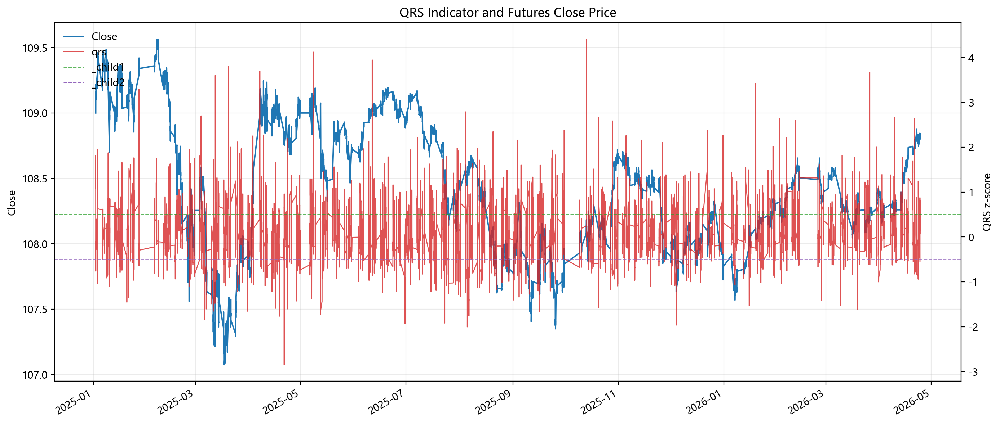
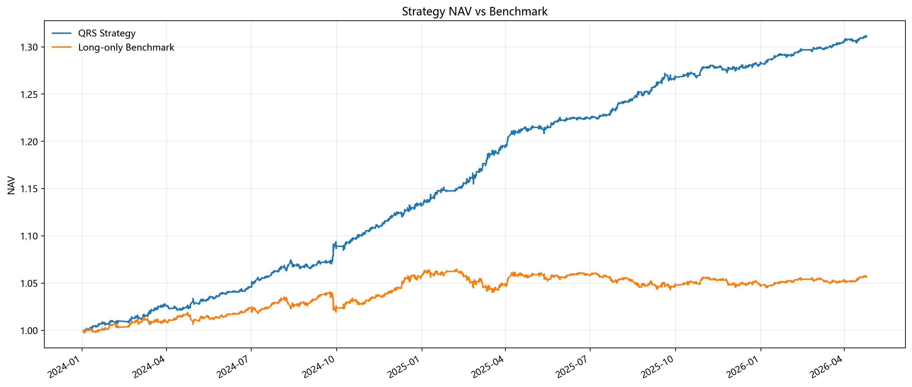
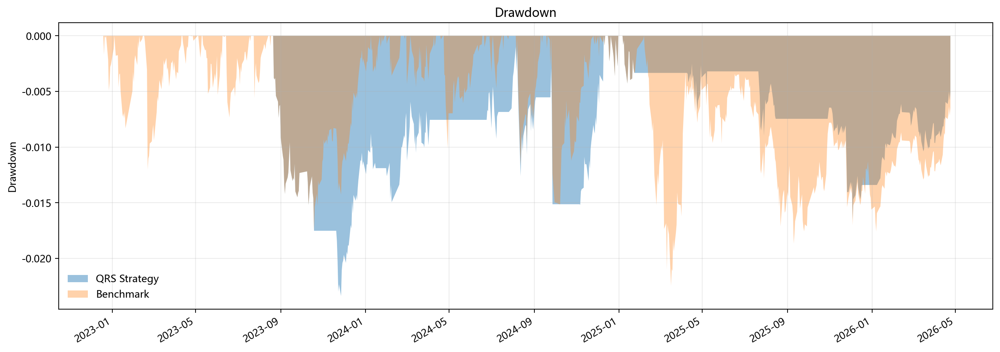
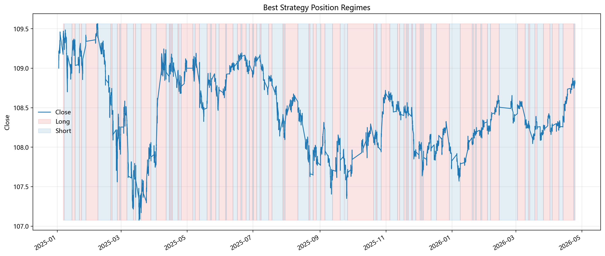
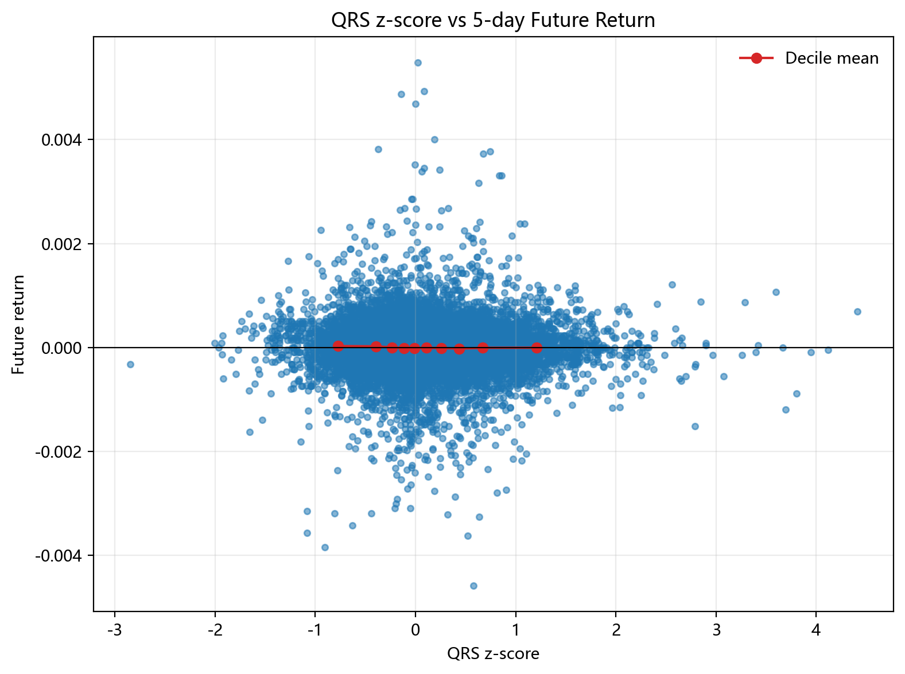

# 基于 QRS 的中国国债期货择时研究报告 | QRS-Based Timing Strategy Report for Chinese Government Bond Futures

<p align="center">
<a href="#zh"></a>
<a href="#en"></a>
</p>

<a id="zh"></a>

## 简体中文

当前语言：中文 | [Switch to English](#en)

---

### 1. 项目概述

本报告展示基于 QRS 指标的中国国债期货择时研究流程。
- **理论来源**：本项目核心思路参考自中金公司（CICC）量化研究报告 **《金融工程视角下的技术择时艺术》**。
- **运行环境**：当前运行模式：`static`；当前运行合约：`TL`；输入数据：`auto`；样本区间：`2024-01-02 09:35:00 至 2026-04-25 11:30:00`。


### 2. 核心模型逻辑

#### 2.1 QRS 因子构建
QRS 类指标通过价格区间中的阻力与支撑关系刻画趋势质量. 在 5 分钟 OHLC 上执行局部回归：

$$
high_t = \alpha + \beta \cdot low_t + \varepsilon_t, \quad t \in \{1,2,\ldots,N\}
$$

对斜率 $\beta$ 进行滚动 Z-score 标准化，并引入 $R^2$ 作为惩罚项：

$$
qrs = zscore(\beta, M) \times (R^2)^n
$$

#### 2.2 信号设计与趋势过滤
状态机规则：
- **做多**：$QRS > +S$ 且日频趋势向上, 仓位设为 1；
- **做空**：$QRS < -S$ 且日频趋势向下, 仓位设为 -1（若允许做空）；
- **维持**：维持上一根 5 分钟 Bar 的原始仓位。

### 3. 参数搜索空间与最佳参数

默认搜索空间包含 $S$ 阈值、趋势判断方式及均线周期等.

本次回测采用的最佳参数：
```json
{
  "S": 0.2,
  "trend_method": "price_compare",
  "ma_len_days": 3.0,
  "compare_lag_days": NaN,
  "ma_short": NaN,
  "ma_long": NaN,
  "cumulative_return": 1.745700134434863,
  "annualized_return": 0.48567031264397786,
  "annualized_volatility": 0.07166043477969425,
  "sharpe_ratio": 6.777384398197898,
  "max_drawdown": -0.024806325567254484,
  "calmar_ratio": 19.57848659718816,
  "win_rate": 0.5328087072273119,
  "turnover": 363.0
}
```

### 4. 回测结果汇总

| Metric                | QRS Strategy   | Long-only Benchmark   |
|:----------------------|:---------------|:----------------------|
| Cumulative Return     | 174.57%        | 11.94%                |
| Annualized Return     | 48.57%         | 5.65%                 |
| Annualized Volatility | 7.17%          | 7.18%                 |
| Sharpe Ratio          | 6.7774         | 0.7870                |
| Max Drawdown          | -2.48%         | -9.73%                |
| Calmar Ratio          | 19.5785        | 0.5812                |
| Win Rate              | 53.28%         | 50.90%                |
| Turnover              | 363.0000       | 0.0000                |

### 5. Debug 辅助指标

| Metric                  | Value               |
|:------------------------|:--------------------|
| sample_start            | 2024-01-02 09:35:00 |
| sample_end              | 2026-04-25 11:30:00 |
| bar_count               | 28451               |
| average_position        | 0.1787              |
| long_ratio              | 58.75%              |
| short_ratio             | 40.88%              |
| cash_ratio              | 0.37%               |
| turnover_count          | 363.0000            |
| benchmark_annual_return | 5.65%               |
| strategy_annual_return  | 48.57%              |
| strategy_sharpe         | 6.7774              |
| max_drawdown            | -2.48%              |

### 6. 可视化图表

#### 6.1 因子与价格叠加


#### 6.2 策略净值对比


#### 6.3 策略回撤


#### 6.4 最佳参数持仓分布


#### 6.5 因子择时能力 (Timing Coefficient)


### 7. 免责声明
本报告仅用于量化研究与代码示例，不构成任何投资建议或收益承诺.

---

<a id="en"></a>

## English

Current language: English | [切换到中文](#zh)

---

### 1. Project Overview

This report presents a QRS-based timing workflow for Chinese government bond futures.
- **Source**: The core logic is inspired by the CICC quantitative research report ***The Art of Technical Timing from a Financial Engineering Perspective***.
- **Environment**: Current mode: `static`; contract: `TL`; input data: `auto`; sample period: `2024-01-02 09:35:00 to 2026-04-25 11:30:00`.
### 2. Core Model Logic

#### 2.1 QRS Factor Construction
QRS indicators describe trend quality through resistance-support relationships. A local regression is performed on 5-minute OHLC bars:

$$
high_t = \alpha + \beta \cdot low_t + \varepsilon_t, \quad t \in \{1,2,\ldots,N\}
$$

The slope $\beta$ is standardized via rolling Z-score and adjusted by an $R^2$ penalty term:

$$
qrs = zscore(\beta, M) \times (R^2)^n
$$

#### 2.2 Signal Design and Trend Filter
The state machine rules:
- **Long**: $QRS > +S$ and daily trend is UP, position becomes 1;
- **Short**: $QRS < -S$ and daily trend is DOWN, position becomes -1 (if allowed);
- **Otherwise**: Carry the previous raw position.

### 3. Parameter Search Space & Best Parameters

The default search space covers $S$ thresholds, trend methods, and MA periods.

Parameters used in this run:
```json
{
  "S": 0.2,
  "trend_method": "price_compare",
  "ma_len_days": 3.0,
  "compare_lag_days": NaN,
  "ma_short": NaN,
  "ma_long": NaN,
  "cumulative_return": 1.745700134434863,
  "annualized_return": 0.48567031264397786,
  "annualized_volatility": 0.07166043477969425,
  "sharpe_ratio": 6.777384398197898,
  "max_drawdown": -0.024806325567254484,
  "calmar_ratio": 19.57848659718816,
  "win_rate": 0.5328087072273119,
  "turnover": 363.0
}
```

### 4. Backtest Results

| Metric                | QRS Strategy   | Long-only Benchmark   |
|:----------------------|:---------------|:----------------------|
| Cumulative Return     | 174.57%        | 11.94%                |
| Annualized Return     | 48.57%         | 5.65%                 |
| Annualized Volatility | 7.17%          | 7.18%                 |
| Sharpe Ratio          | 6.7774         | 0.7870                |
| Max Drawdown          | -2.48%         | -9.73%                |
| Calmar Ratio          | 19.5785        | 0.5812                |
| Win Rate              | 53.28%         | 50.90%                |
| Turnover              | 363.0000       | 0.0000                |

### 5. Debug Metrics

| Metric                  | Value               |
|:------------------------|:--------------------|
| sample_start            | 2024-01-02 09:35:00 |
| sample_end              | 2026-04-25 11:30:00 |
| bar_count               | 28451               |
| average_position        | 0.1787              |
| long_ratio              | 58.75%              |
| short_ratio             | 40.88%              |
| cash_ratio              | 0.37%               |
| turnover_count          | 363.0000            |
| benchmark_annual_return | 5.65%               |
| strategy_annual_return  | 48.57%              |
| strategy_sharpe         | 6.7774              |
| max_drawdown            | -2.48%              |

### 6. Visualization

#### 6.1 Factor & Price Overlay


#### 6.2 Strategy NAV Comparison


#### 6.3 Strategy Drawdown


#### 6.4 Best Strategy Position


#### 6.5 Timing Coefficient (QRS Future Return)


### 7. Disclaimer
This report is for quantitative research and demonstration only. It does not constitute investment advice or any return guarantee.
